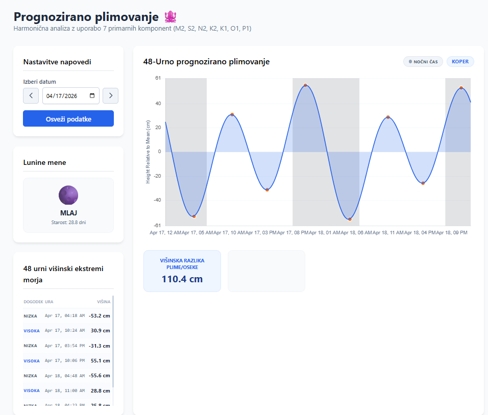

# Tide Chart - Koper, Slovenia

A real-time tidal prediction application for Koper Bay, Slovenia, using harmonic analysis of astronomical tidal constituents.



## Overview

This project calculates and visualizes tide heights throughout the day using the standard method of harmonic tidal prediction. The application decomposes the complex tidal signal into 7 primary constituents (M2, S2, N2, K2, K1, O1, P1) representing the gravitational influences of the Sun and Moon.

## Features

- Real-time tide height prediction for Koper Bay
- Interactive chart showing 24-hour tide cycles
- High and low tide markers with precise timing
- Date navigation (previous/next day, date picker)
- Smooth area-spline visualization
- Current tide level indicator
- Moon phase prediction
- Day/night periods marked with gray shading on the chart

## Project Structure

```
├── index.html          # Main application page
├── css/
│   └── tideKP.css     # Styling for the tide chart
├── js/
│   ├── Arcots.js      # Astronomical and tidal constituent calculator
│   └── Tide.js        # Tide prediction and chart rendering
└── README.md          # This file
```

## How It Works

### Harmonic Tidal Analysis

The tide prediction is based on the harmonic method:

```
Tide Height = Σ [f × H × cos(S × t + (V0+u) - G)]
```

Where:
- `f` = Nodal factor (accounts for 18.6-year lunar cycle)
- `H` = Mean amplitude for each constituent
- `S` = Angular speed (radians per hour)
- `t` = Time (hours since Jan 1st)
- `V0+u` = Equilibrium argument (astronomical phase)
- `G` = Phase lag (local adjustment)

### Tidal Constituents

The 7 primary constituents used:

| Code | Name | Type | Period |
|------|------|------|--------|
| M2 | Principal lunar semidiurnal | Semidiurnal | 12.42 hours |
| S2 | Principal solar semidiurnal | Semidiurnal | 12.00 hours |
| N2 | Larger lunar elliptic | Semidiurnal | 12.66 hours |
| K2 | Lunisolar semidiurnal | Semidiurnal | 11.97 hours |
| K1 | Lunisolar diurnal | Diurnal | 23.93 hours |
| O1 | Lunar diurnal | Diurnal | 25.82 hours |
| P1 | Solar diurnal | Diurnal | 24.07 hours |

## Usage

1. Open `index.html` in a web browser
2. The chart displays the current day's tide predictions
3. Use navigation buttons to view previous/next days
4. Click on the date picker to jump to a specific date
5. Hover over the chart for detailed tide information

## Technical Details

### Arcots.js

Handles astronomical calculations:
- Nodal factor computation (18.6-year lunar cycle)
- Equilibrium arguments (celestial body positions)
- Mean longitude calculations for Sun, Moon, and lunar perigee
- Orbital coefficient adjustments

### Tide.js

Manages tide prediction and visualization:
- Calculates tide heights at any given time
- Generates high-resolution chart data (1440 points per day)
- Identifies high and low tide times
- Renders interactive C3.js chart

## Dependencies

- [C3.js](https://c3js.org/) - Chart library
- [D3.js](https://d3js.org/) - Data visualization (required by C3.js)

## Location-Specific Data

The harmonic constants (amplitudes and phase lags) are calibrated specifically for Koper Bay, Slovenia. To adapt this application for a different location, you would need to:

1. Obtain harmonic constants for your location from tidal authorities
2. Update the `H` (amplitudes) and `G` (phase lags) arrays in `Arcots.js`

## Learn More

- [NOAA Tidal Analysis](https://tidesandcurrents.noaa.gov/publications/glossary2.pdf)
- [Harmonic Constants](https://www.psmsl.org/train_and_info/training/tidal_analysis/)
- [UK Hydrographic Office - Tidal Prediction](https://www.ukho.gov.uk/tides/tidal-prediction)
- [IHO Tidal Constituent Database](https://iho.int/en/tidal-constituent-data)

## License

This project is provided as-is for educational and practical use.

## Author

Developed for tide prediction in Koper Bay, Slovenia.

This project is inherited from the [Morska biološka postaja Piran](http://www.mbss.org/) (Marine Biology Station Piran) website, adapted and enhanced for modern web standards.
